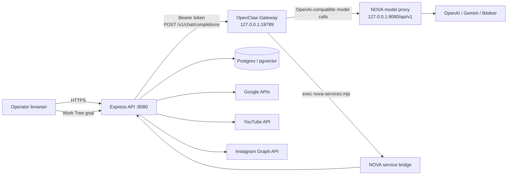

# NOVA Architecture — Embedded OpenClaw Backend

NOVA is one deployable service composed of three cooperating runtime layers:

1. the browser application in `artifacts/nova`;
2. the Express API in `artifacts/api-server`;
3. an official OpenClaw Gateway bound to container loopback only.

The OpenClaw Gateway is the execution backend for Work Tree missions. The older
custom `work-tree-worker.mjs` remains in the repository for historical reference
but is not started by the production image.

## Runtime topology



## Boot sequence

`node scripts/start-openclaw.mjs` is PID 1.

1. It resolves or generates the internal Gateway and peer-auth tokens.
2. It starts `openclaw gateway` on `127.0.0.1:18789`.
3. It polls the Gateway health endpoint until it is ready.
4. It starts `dist/index.mjs` on the public Render port.
5. If either child exits, the supervisor stops the other child and exits
   non-zero so the platform can restart the container.

The API is therefore never marked available while the OpenClaw execution
backend is absent.

## Work Tree lifecycle

1. `POST /api/work-tree/runs` validates and persists a goal.
2. `work-tree.ts` dispatches that goal to the loopback OpenClaw Chat
   Completions endpoint with a stable per-run session key.
3. OpenClaw executes a normal agent run using its workspace, tools and skills.
4. The `nova-services` skill exposes the services already implemented by NOVA.
5. The final verified report is stored on the existing `work_tree_runs` row, so
   the current Work Tree UI and polling contract remain compatible.
6. Pending or running rows are reconciled at API startup after a restart.

Cancellation aborts the active fetch for the in-process run. Retry dispatches
the original mission through OpenClaw again rather than waking the retired
legacy worker.

## Model path

OpenClaw uses a custom provider named `nova`. Its base URL is the internal NOVA
model proxy:

```text
OpenClaw -> http://127.0.0.1:8080/api/v1 -> provider selected by model id
```

The model proxy keeps provider secrets server-side and preserves NOVA's existing
scratchpad and knowledge-context injection. The default model id is controlled
by `NOVA_OPENCLAW_MODEL_ID` and defaults to `gpt-4o-mini`.

## Service bridge

The workspace skill at
`openclaw/workspace/skills/nova-services/SKILL.md` documents the executable
bridge `nova-services.mjs`. It can call these authenticated loopback APIs:

| Capability | NOVA endpoint |
|---|---|
| Integration credential status | `GET /api/integrations` |
| Gmail search/list | `GET /api/integrations/gmail/messages` |
| Google Drive files | `GET /api/integrations/drive/files` |
| Google Docs read | `GET /api/integrations/docs/:id` |
| Google Sheets read | `GET /api/integrations/sheets/:id` |
| YouTube search | `GET /api/integrations/youtube/search` |
| Instagram media | `GET /api/integrations/instagram/media` |
| Knowledge search | `POST /api/knowledge/search` |
| Knowledge ingest | `POST /api/knowledge/ingest` |
| Skills catalog | `GET /api/skills` |
| Scratchpad | `GET /api/scratchpad` |

The bridge authenticates with an internal bearer token and prints structured
JSON. It does not expose stored service credentials to the model.

## Security boundaries

- OpenClaw binds to loopback, not the public network interface.
- The Gateway Chat Completions endpoint requires a bearer token.
- The OpenClaw control UI is disabled in this deployment.
- The service bridge calls only `127.0.0.1` and uses the existing API auth gate.
- Provider API keys remain in Render environment variables and are consumed by
  NOVA's model proxy, not written into the OpenClaw configuration.
- Unknown OpenClaw configuration keys fail startup because OpenClaw validates
  its configuration strictly.
- No destructive external action is implied by a model response; completion is
  recorded only when a non-empty Gateway final payload is received.

## Health and evidence

- `GET /api/healthz` verifies the Express process.
- `GET /api/openclaw/status` verifies that the loopback Gateway responds and
  returns its reported runtime metadata.
- Production acceptance requires both endpoints, the UI, and a real authenticated
  Work Tree run to succeed.

See `docs/OPENCLAW_BACKEND.md` for configuration, deployment and troubleshooting.
